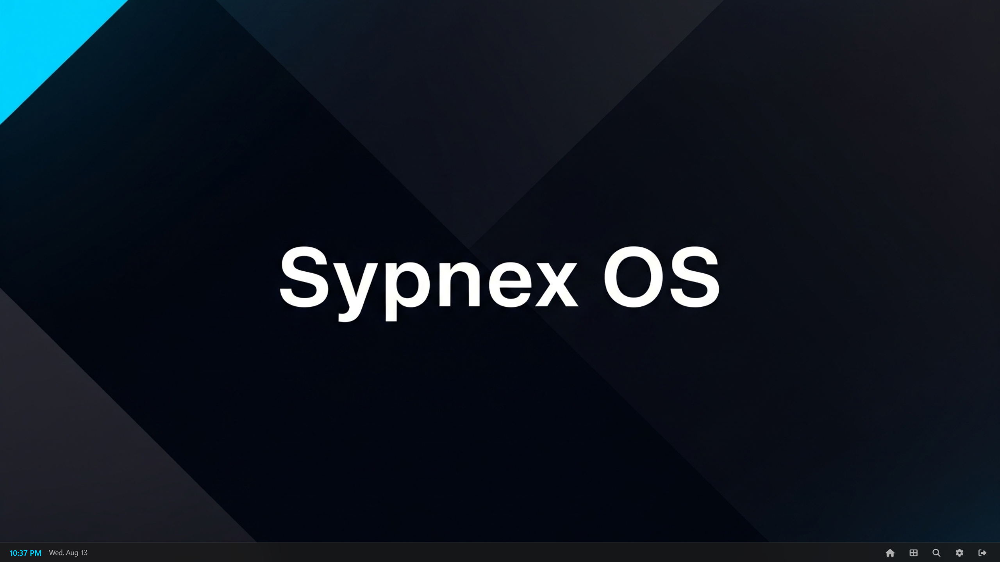

# Sypnex OS

[](https://opensource.org/licenses/MIT)
[](https://www.python.org/downloads/)
[](docs/CONTRIBUTING.md)

A web-based operating system interface built with Flask and vanilla JavaScript, providing a desktop-like experience with window management, app sandboxing, and API system for user applications.

> **🚀 Active Development**: Sypnex OS is an open-source project in active development. We welcome contributions to help reach production readiness. Whether you're interested in feature development, testing, documentation, or UI/UX improvements, contributions are welcome.


# Demo

[](https://sypnex-llc.github.io/sypnex-os/demo/)


## 🚀 Quick Start

Sypnex OS is a **web-based desktop environment** that runs in your browser. Think of it as a complete operating system interface that you can deploy via Docker and own completely.

## 🚀 What is Sypnex OS?

**Sypnex OS** is a modular web-based operating system that runs in your browser. It provides a desktop experience with development tools, extensible APIs, and integration capabilities.

Think of it as a **web desktop** that connects to backend services, AI models, and external APIs. It's designed for developers, AI researchers, and users who need a flexible platform for building and managing applications.

### Why Sypnex OS?

**Own Your Environment**: Deploy via Docker and control your entire environment without vendor lock-in.

**Modularity**: Built with extensibility in mind. Every component is modular, from services to UI elements.

**Security**: App sandboxing ensures safety while maintaining API access for applications.

**Web Standards**: Built with vanilla JavaScript and modern web APIs.

**AI Integration**: Designed to integrate with AI models and external APIs for modern development workflows.

Sypnex OS provides a customizable development environment that you can own and modify. Whether you're building AI applications, need a sandboxed environment, or want to create web-based tools, Sypnex OS provides the foundation.

## 📱 Official Apps Repository

**[Sypnex OS Apps](https://github.com/Sypnex-LLC/sypnex-os-apps)** - Ready-to-use applications and comprehensive development tools

**For App Developers:**
- **[Complete Development Guide](https://github.com/Sypnex-LLC/sypnex-os-apps/blob/master/USER_APP_DEVELOPMENT_GUIDE.md)** - Build apps on Sypnex OS
- **[VS Code Extension](https://github.com/Sypnex-LLC/sypnex-os-vscode-extension)** - IntelliSense for 65+ SypnexAPI methods
- **Development Tools** - App scaffolding, deployment, and packaging utilities

The apps repository demonstrates the full potential of building on Sypnex OS and provides all the tools needed for development.

## 🤖 Built with AI Collaboration

Sypnex OS was built through collaboration between human creativity and AI assistance. What started as experimental "vibe coding" sessions evolved into a comprehensive operating system that demonstrates the potential of human-AI partnership in software development.

### The Development Story
- **Started with Vision**: A human idea for a web-based OS that could be owned and customized
- **AI-Assisted Architecture**: Core system architecture and components designed through iterative AI collaboration
- **Continuous Refinement**: Features, APIs, and documentation developed through ongoing human-AI partnership
- **Community-Driven Evolution**: Now transitioning to community contributions while maintaining the AI-assisted development approach

This project showcases how modern AI tools can amplify human creativity to build complex software. The majority of the codebase was generated through AI assistance, with human guidance, refinement, and strategic direction throughout the process.

This represents an approach where human insight combines with AI capabilities to create software development outcomes.

## 🎯 Key Features

### Core Interface
- **Desktop Experience**: Window management, taskbar, and spotlight search
- **Real-time Communication**: WebSocket infrastructure for app development
- **Service System**: Extensible architecture with hot-reloadable services
- **Virtual File System**: SQLite-based file storage with full CRUD operations
- **User App Ecosystem**: Sandboxed applications with JavaScript API access

### System Features
- **Service Management**: Lifecycle management for background services
- **Settings Persistence**: App-specific configuration storage

## 🔧 Quick Start

### Prerequisites
- Python 3.7 or higher
- Modern web browser

### Installation
```bash
# Clone the repository
git clone <repository-url>
cd sypnex-os

# Install dependencies
pip install -r requirements.txt

# Copy demo configuration
cp .env.example .env

# Run the application
python run_dev.py

# Open browser to http://localhost:5000
# Demo credentials: username=demo, password=test123
```

### Docker Deployment
```bash
# Using docker-compose (includes demo credentials)
docker-compose up

# Access at http://localhost:5000
# Demo credentials: username=demo, password=test123
```

**⚠️ Security Note**: Change the demo credentials for production use. See [AUTHENTICATION.md](docs/AUTHENTICATION.md) for details.

## 🤝 Contributing

We welcome contributions to Sypnex OS! Whether you're interested in core development, creating applications, testing, documentation, or UI improvements, there are many ways to get involved.

See our **[Contributing Guide](docs/CONTRIBUTING.md)** for detailed information on how to contribute.

For questions and discussions:
- **[GitHub Discussions](https://github.com/Sypnex-LLC/sypnex-os/discussions)** - Questions & Support
- **[GitHub Issues](https://github.com/Sypnex-LLC/sypnex-os/issues)** - Bug Reports & Feature Requests

## 📄 License

This project is licensed under the MIT License - see the [LICENSE](LICENSE) file for details. This means you're free to use, modify, and distribute Sypnex OS for any purpose, including commercial use.

## 📚 Documentation

### Core System Documentation
- **[🚀 Roadmap](docs/ROADMAP.md)** - Project vision and development milestones
- **[🤝 Contributing Guide](docs/CONTRIBUTING.md)** - How to contribute to the core OS
- **[⚙️ Core Components](docs/SYPNEX_OS_CORE_COMPONENTS.md)** - Detailed architecture and system components
- **[🖥️ Frontend Architecture](docs/SYPNEX_OS_FRONTEND_ARCHITECTURE.md)** - Frontend system design and APIs

### App Development Documentation
- **[📱 User App Development Guide](https://github.com/Sypnex-LLC/sypnex-os-apps/blob/master/USER_APP_DEVELOPMENT_GUIDE.md)** - Complete guide for creating apps (in apps repository)
- **[VS Code Extension](https://github.com/Sypnex-LLC/sypnex-os-vscode-extension)** - IntelliSense support for SypnexAPI
- **[Official Apps Repository](https://github.com/Sypnex-LLC/sypnex-os-apps)** - Apps, examples, and development tools

---

*Thank you for exploring Sypnex OS.*
